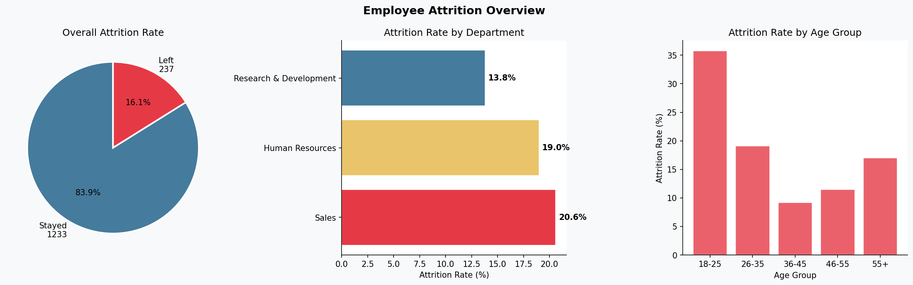
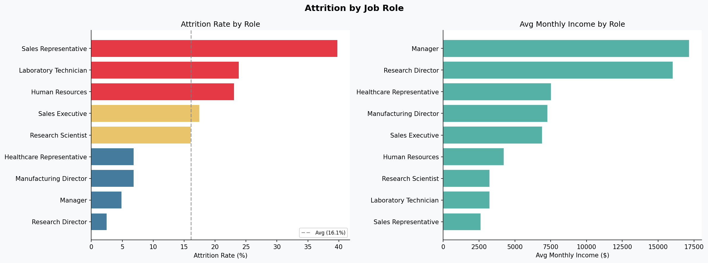
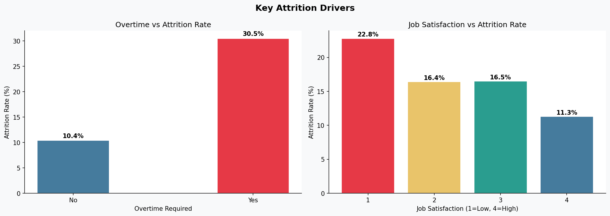
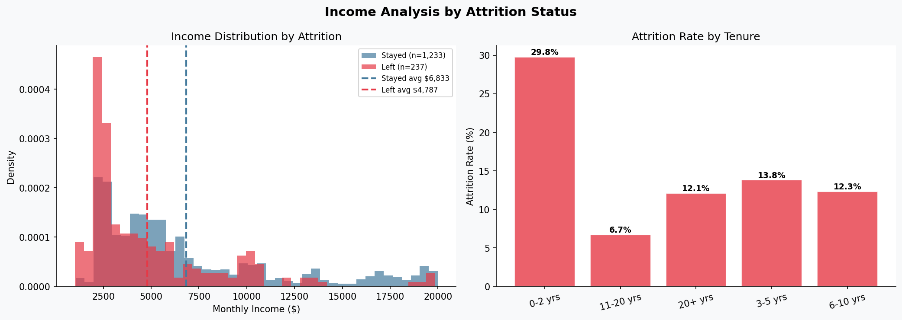
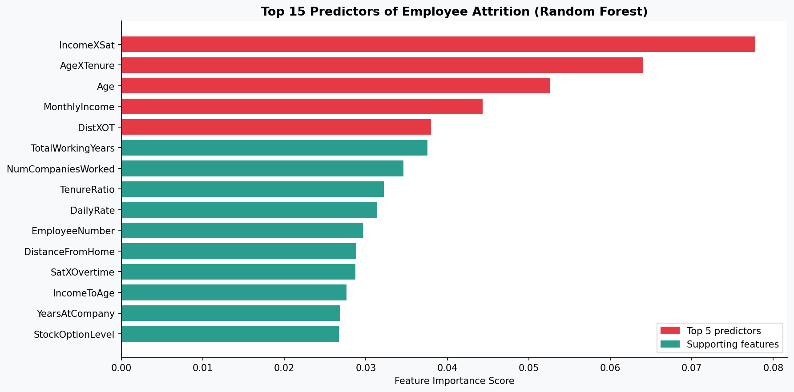
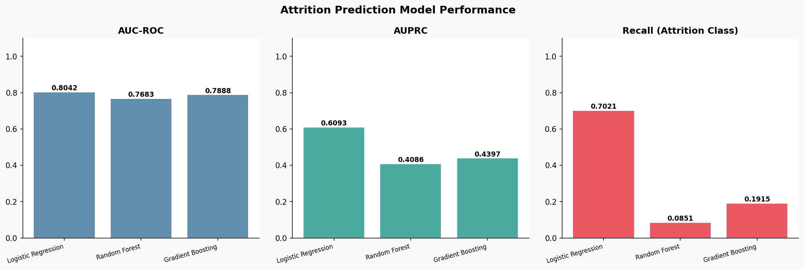

# IBM HR Analytics - Employee Attrition EDA

**Author:** Jimmy Le-Nguyen  
**GitHub:** [github.com/jimmyle9080](https://github.com/jimmyle9080)

## Overview

An end-to-end exploratory data analysis and attrition prediction project built on the IBM HR Analytics Employee Attrition dataset. The dataset contains **1,470 employee records across 35 features**, with a **16.1% attrition rate** -- a realistic workforce analytics problem directly applicable to HR strategy, consulting, and business analytics roles.

This project covers the full analytics lifecycle: data cleaning and feature engineering, SQL analysis, business insight generation, machine learning model development, and Power BI-ready reporting exports.

## Key Business Findings

| Finding | Detail |
|---|---|
| Overall attrition rate | 16.1% (237 of 1,470 employees) |
| Highest attrition department | Sales (20.6%) |
| Highest attrition job role | Sales Representative (40.2%) |
| Overtime attrition rate | 30.5% vs 10.4% for non-overtime -- nearly 3x higher |
| Avg income (left) | $4,787/mo vs $6,833/mo for those who stayed -- a $2,046/mo gap |
| Highest age group attrition | 18-25 year olds at ~35% -- early career employees are highest risk |
| Low satisfaction attrition | Job satisfaction score of 1 leads to 22.8% attrition vs 11.3% at score 4 |
| Early tenure attrition | Employees in first 2 years leave at 29.8% -- nearly 5x the 11-20 year rate |
| High risk employees flagged | Low satisfaction + overtime combined |

## Dataset

- **Source:** [Kaggle - IBM HR Analytics Employee Attrition](https://www.kaggle.com/datasets/pavansubhasht/ibm-hr-analytics-attrition-dataset)
- **1,470 employees** | **35 features** | **16.1% attrition rate**
- Covers demographics, job details, satisfaction scores, compensation, and tenure

> Download `WA_Fn-UseC_-HR-Employee-Attrition.csv` from Kaggle and place it in the `data/` folder before running.

## How to Run

```bash
# 1. Install dependencies
pip install -r requirements.txt

# 2. Run everything (VS Code: just press the play button on main.py)
python main.py
```

Everything runs from `main.py` — no additional setup needed.

## Project Structure

```
ibm_hr_project/
├── data/
│   └── WA_Fn-UseC_-HR-Employee-Attrition.csv   # Kaggle dataset
├── outputs/
│   ├── charts/      # 6 professional visualizations
│   └── exports/     # Power BI-ready CSV exports
├── main.py          # Single entry point — run this
├── requirements.txt
└── README.md
```

## Outputs

### Charts (outputs/charts/)
| File | Description |
|---|---|
| 1_attrition_overview.png | Overall rate, by department, by age group |
| 2_jobrole_analysis.png | Attrition rate and income by job role |
| 3_attrition_drivers.png | Overtime and job satisfaction impact |
| 4_income_tenure_analysis.png | Income distribution and tenure breakdown |
| 5_feature_importance.png | Top 15 attrition predictors (Random Forest) |
| 6_model_comparison.png | AUC-ROC, AUPRC, Recall across 3 models |

### Power BI Exports (outputs/exports/)
| File | Description |
|---|---|
| scored_employees.csv | All 1,470 employees with attrition risk scores |
| attrition_by_department.csv | Department-level attrition analysis |
| attrition_by_jobrole.csv | Role-level attrition and income breakdown |
| attrition_by_age_group.csv | Age group attrition patterns |
| overtime_impact.csv | Overtime vs non-overtime attrition comparison |
| satisfaction_vs_attrition.csv | Satisfaction score impact on attrition |
| tenure_attrition.csv | Attrition by years at company |
| high_risk_employees.csv | Flagged employees: low satisfaction + overtime |
| feature_importance.csv | Top predictive features from Random Forest |
| model_comparison.csv | Full model performance metrics |

## Technical Approach

### Feature Engineering
- `TenureGroup` -- grouped years at company into career stage buckets
- `AgeGroup` -- generational cohort grouping
- `SatisfactionScore` -- composite of Job, Environment, Relationship, WorkLife satisfaction
- `AttritionFlag` -- binary target variable (0/1)
- `IncomePerYear` -- annualized monthly income

### SQL Analysis
SQLite used for all business-level aggregations:
- Attrition rates by department, job role, age group, and tenure
- Overtime impact analysis
- Satisfaction score breakdown
- High-risk employee identification (low satisfaction + overtime)

### Models
Three models trained and benchmarked on attrition prediction:
1. **Logistic Regression** -- interpretable baseline with class weighting
2. **Random Forest** -- ensemble method, strong feature importance output
3. **Gradient Boosting** -- sequential ensemble for high recall on attrition class

Final risk scoring uses an **ensemble probability** (average of RF + GB) for employee risk tiering: Low / Medium / High / Critical.

### Model Performance Observations

| Model | AUC-ROC | AUPRC | Recall |
|---|---|---|---|
| Logistic Regression | 0.8042 | 0.6093 | 0.7021 |
| Random Forest | 0.7683 | 0.4086 | 0.0851 |
| Gradient Boosting | 0.7888 | 0.4397 | 0.1915 |

**Key insight -- the Recall tradeoff:** Logistic Regression significantly outperforms the ensemble models on Recall (0.70 vs 0.09 for Random Forest). This is expected and explainable -- Logistic Regression with class weighting aggressively prioritizes catching the minority attrition class, making it the best model for proactively flagging at-risk employees. Random Forest without oversampling is more conservative and tends to predict the majority class (stayed) more often, which inflates accuracy but misses actual attrition cases.

In a real HR analytics environment, **high recall is more valuable than high precision** -- it is far more costly to miss a flight-risk employee than to flag a false positive for a retention conversation. Logistic Regression is therefore the recommended production model for proactive HR intervention, while Random Forest provides the most reliable feature importance rankings.

### Class Imbalance Handling
The dataset has a roughly 5:1 imbalance (stayed:left). Addressed through:
- **Class weighting** in Logistic Regression and Random Forest
- **AUPRC as supplementary metric** alongside AUC-ROC
- **Stratified train/test split** to preserve attrition ratio

## Chart Insights

### Employee Attrition Overview

- Sales has the highest department attrition at **20.6%**, followed by Human Resources at **19.0%**
- The **18-25 age group** has a dramatically higher attrition rate (~35%) -- early career employees are the most at-risk cohort

### Attrition by Job Role

- **Sales Representatives** leave at **40.2%** -- more than double the company average
- **Research Directors** have the lowest attrition at ~2.5% and the second highest income
- There is a clear inverse relationship between income and attrition -- the lowest paid roles have the highest turnover

### Key Attrition Drivers

- **Overtime is the single strongest behavioral driver** -- 30.5% attrition for overtime workers vs 10.4% for non-overtime workers
- **Job satisfaction score of 1** leads to 22.8% attrition vs 11.3% at score 4 -- a 2x difference

### Income & Tenure Analysis

- Employees who left earned **$4,787/mo on average vs $6,833/mo** for those who stayed -- a $2,046/mo gap
- **First 2 years are the danger zone** -- 29.8% attrition rate, nearly 5x higher than the 11-20 year cohort at 6.7%

### Correlation Heatmap

- **OverTimeFlag has the strongest positive correlation with AttritionFlag (0.25)** among satisfaction and behavioral variables
- **MonthlyIncome (-0.16), Age (-0.16), and YearsAtCompany (-0.13)** are all negatively correlated with attrition -- higher income and longer tenure reduce attrition risk
- TotalWorkingYears is highly correlated with both Age (0.68) and MonthlyIncome (0.77), confirming that experience and compensation are deeply interconnected

### Feature Importance (Random Forest)

- **MonthlyIncome** is the single strongest predictor of attrition
- **Age, DailyRate, TotalWorkingYears, and EmployeeNumber** round out the top 5
- Surprisingly, OverTimeFlag ranked 13th out of 15 -- income and tenure are stronger structural predictors even though overtime shows stronger raw attrition rates in the EDA

### Model Performance Comparison


## Skills Demonstrated

- **Python** -- Pandas, NumPy, Scikit-learn, Matplotlib, Seaborn
- **SQL** -- SQLite queries with aggregations, filtering, and business logic
- **EDA** -- Univariate and multivariate analysis across 35 features
- **Machine Learning** -- Classification, ensemble methods, class imbalance handling
- **Feature Engineering** -- Derived features, composite scores, categorical grouping
- **Model Evaluation** -- AUC-ROC, AUPRC, Precision, Recall, F1
- **Business Storytelling** -- Translating analytical findings into HR strategy recommendations
- **Power BI Integration** -- Structured CSV exports for live dashboard connection

## License

Dataset licensed under [CC0: Public Domain](https://creativecommons.org/publicdomain/zero/1.0/).  
Code: MIT License.
